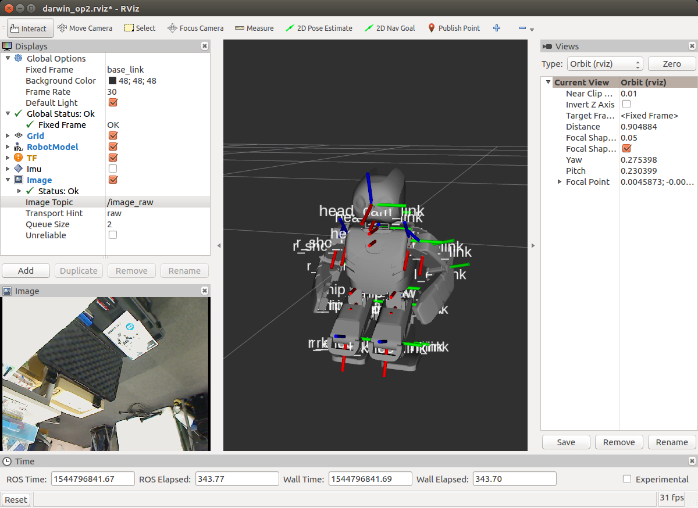
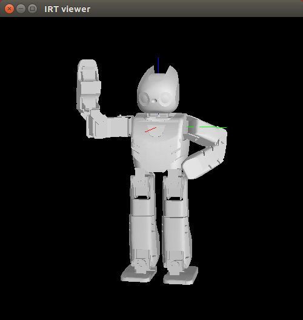

# jsk_darwin

### Install

```bash
# add ros to apt source.list
sudo sh -c 'echo "deb http://packages.ros.org/ros/ubuntu trusty main" > /etc/apt/sources.list.d/ros-latest.list'
sudo apt-key adv --keyserver hkp://pool.sks-keyservers.net --recv-key 0xB01FA116

sudo apt-get update

# install fundamental ros requisities
sudo apt-get install python-catkin-tools python-wstool python-rosdep python-pip python-setuptools ros-indigo-rosbash

source /opt/ros/indigo/setup.bash

# create catkin source directory
mkdir -p ~/ros/ws_darwin/src
cd ~/ros/ws_darwin/src
wstool init
wstool merge  https://raw.githubusercontent.com/mmurooka/jsk_darwin/fix-for-using-robotis-official-repo/darwin-op2.rosinstall -t .
wstool up -j 10

# install dependencies
sudo rosdep init
rosdep update
rosdep install --from-paths . --ignore-src -r -n -y --rosdistro indigo

# build packages
cd ~/ros/ws_darwin
catkin init
catkin build

# source to use programs
echo 'source $HOME/ros/ws_darwin/devel/setup.bash' >> ~/.bashrc
exec -l $SHELL
```

### Launch robot

```bash
ssh robotis@<ip address of darwin> # Darwin IP
sudo bash
roslaunch jsk_darwin darwin_op2.launch
# Servo becomes on and Darwin stands up and then sit down.
```

### Launch robot camera (unnecessary if you don't use camera)

```bash
ssh robotis@<ip address of darwin> # Darwin IP
sudo bash
roslaunch jsk_darwin darwin_op2_camera.launch
# /image_raw topic starts to be published.
# If program causes error, you need to reboot Darwin PC.
```

### Visualize

```bash
rossetrobot <ip address of darwin>
rossetip # use same network of robot
source ~/ros/ws_darwin/devel/setup.bash

roslaunch jsk_darwin darwin_op2_rviz.launch
# Rviz launches and Darwin model is visualized.
# Check IMU in displays panel to visualize IMU data.
```


### Move from EusLisp

```bash
rossetrobot <ip address of darwin>
rossetip # use same network of robot
source ~/ros/ws_darwin/devel/setup.bash

roscd jsk_darwin/euslisp
roseus robotis_op2-interface.l # run euslisp with prompt $ and ;; for comments

;; initialize robot interface
$ (robotis_op2-init)
$ (objects (list *robotis_op2*))

;; send command
$ (send *robotis_op2* :init-pose)
$ (send *ri* :angle-vector (send *robotis_op2* :angle-vector) 10000)
$ (send *ri* :wait-interpolation)

;; get actual state
$ (send *robotis_op2* :angle-vector (send *ri* :state :potentio-vector))
```

